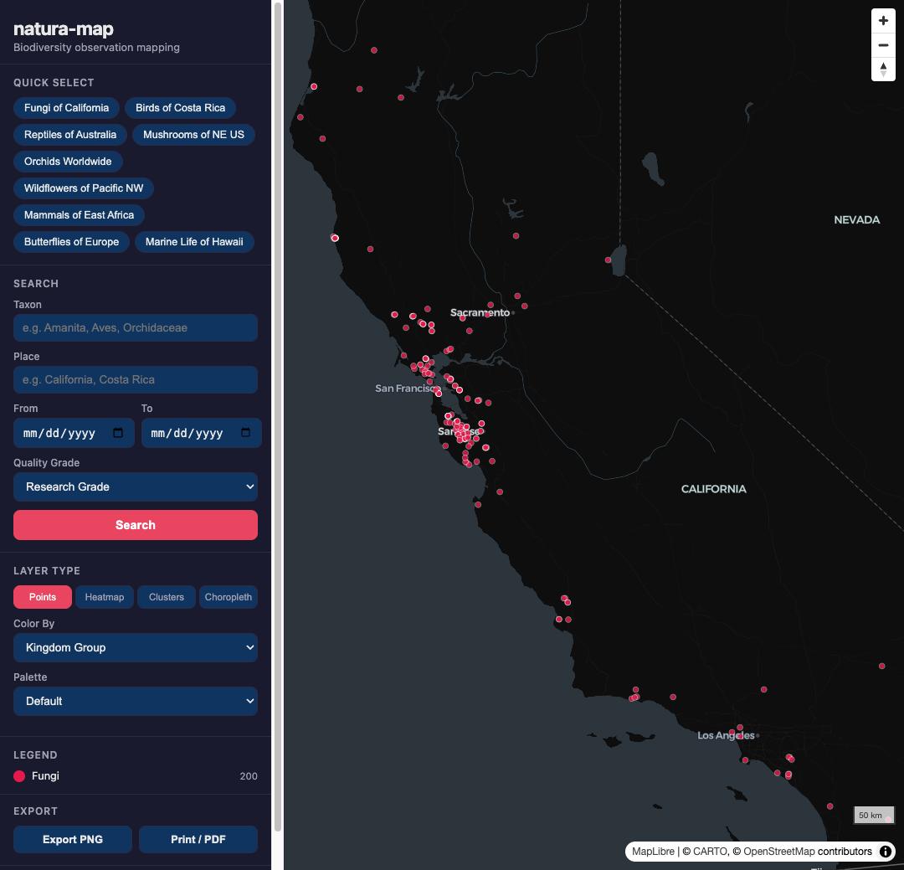

# natura-map: Biodiversity Observation Mapping

*2026-02-17T15:43:28Z by Showboat 0.6.0*
<!-- showboat-id: 635ad031-3b4d-456b-98d1-0c01734d8741 -->

An interactive JavaScript web app that renders iNaturalist biodiversity observation data on maps. Built on MapLibre GL JS with Turf.js spatial joins, 4 color palettes, and map export.

### Tech Stack
- MapLibre GL JS (GPU-accelerated vector tiles)
- Turf.js (point-in-polygon spatial join)
- Vite (dev server + bundler)
- Vanilla JS (zero framework)
- CARTO Positron dark basemap (free, no API key)

### Features
- 4 layer types: points, heatmap, clusters, choropleth
- Turf.js spatial join for choropleth (proper point-in-polygon)
- 4 color palettes (default, earth, ocean, vivid)
- 9 quick-select presets
- Map export (PNG + Print/PDF)
- iNaturalist API with rate limiting (1 req/sec)
- Pre-cached default dataset
- IndexedDB caching
- Responsive mobile UI

```bash
find src -type f -name '*.js' | sort && echo '---' && cat src/**/*.js src/**/**/*.js 2>/dev/null | wc -l
```

```output
src/data/api.js
src/data/cache.js
src/data/transform.js
src/main.js
src/map/deckgl.js
src/map/engine.js
src/map/layers/choropleth.js
src/map/layers/clusters.js
src/map/layers/heatmap.js
src/map/layers/points.js
src/map/palette.js
src/ui/controls.js
src/ui/export.js
src/ui/legend.js
src/ui/quickselect.js
src/ui/search.js
---
    1834
```

16 source files, ~1,834 lines of JavaScript.

### Build

```bash
npx vite build 2>&1
```

```output
vite v6.4.1 building for production...
transforming...
✓ 32 modules transformed.
rendering chunks...
computing gzip size...
dist/index.html                     4.20 kB │ gzip:   1.23 kB
dist/assets/index-DIAFRyHI.css      5.13 kB │ gzip:   1.49 kB
dist/assets/index-Bm0f5lJb.js   1,052.13 kB │ gzip: 287.05 kB │ map: 2,296.93 kB

(!) Some chunks are larger than 500 kB after minification. Consider:
- Using dynamic import() to code-split the application
- Use build.rollupOptions.output.manualChunks to improve chunking: https://rollupjs.org/configuration-options/#output-manualchunks
- Adjust chunk size limit for this warning via build.chunkSizeWarningLimit.
✓ built in 1.26s
```

Build succeeds. ~1MB bundle (MapLibre GL JS is ~900KB minified). Deck.gl is lazy-loaded on demand.

### Running locally

```bash
echo 'npm install && npm run dev' && echo 'Then open http://localhost:3000'
```

```output
npm install && npm run dev
Then open http://localhost:3000
```

```bash {image}
natura-map-points.png
```



Points layer colored by taxonomic family with default palette.

```bash {image}
natura-map-ocean-palette.png
```


Ocean palette with same data.
